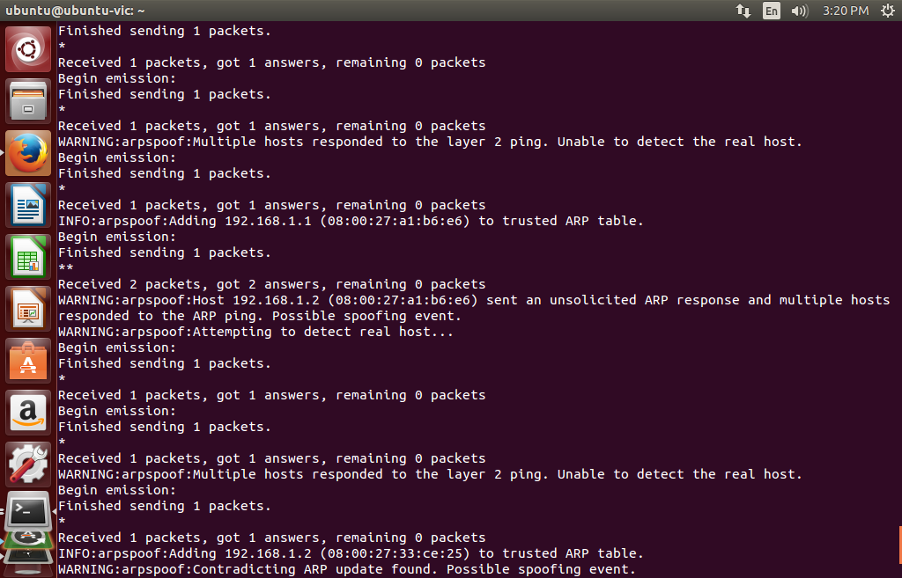

# arpspoof

Detect ARP spoofing using active approach proposed by Ramachandran, et al. (2005).



## Prerequisite

- Python 3.9
- Pipenv

## Running

```
pipenv install
sudo pipenv run arpspoof.py --help
```

## Building standalone executable using pyinstaller

```
pipenv install --dev
pipenv run pyinstaller --onefile arpspoof.py
# Optional: set raw socket access capabilities to allow packet capture without root.
sudo setcap 'cap_net_raw,cap_net_admin=eip' dist/arpspoof
```

Note that to build an executable usable on FCS Security Ubuntu VM, one must build on a Ubuntu 14.04 VM with Internet access.  One must also install Python 3.9 on the VM. It can be done via pyenv with a recent build of OpenSSL, specified by extra configure option `--with-openssl=<openssl-install-prefix>`. Moreover, PyInstaller also requires the Python configure option `--enable-shared` to function properly.

Below steps worked for me. Note that not all steps may be strictly necessary.

```
cd /home/ubuntu/Downloads/openssl-1.1.1k

# Build and install OpenSSL.
./Configure --prefix=$(readlink -f ../openssl-dist) --openssldir=$(readlink -f ../openssl-dist/etc/ssl) --libdir=lib shared no-ssl3-method enable-ec_nistp_64_gcc_128 linux-x86_64
make -j22
make install

# Set variables that may be used to include our OpenSSL installation.
export PATH=/home/ubuntu/Downloads/openssl-dist/bin:$PATH
export LD_LIBRARY_PATH=/home/ubuntu/Downloads/openssl-dist/lib
export LDFLAGS="-L/home/ubuntu/Downloads/openssl-dist/lib -Wl,-rpath,/home/ubuntu/Downloads/openssl-dist/lib"
export CFLAGS="-I/home/ubuntu/Downloads/openssl-dist/include/openssl"
export CPPFLAGS="-I/home/ubuntu/Downloads/openssl-dist/include/openssl"
export PKG_CONFIG_PATH=/home/ubuntu/Downloads/openssl-dist/lib/pkgconfig:$PKG_CONFIG_PATH

# Build Python 3.9.2 using pyenv
CONFIGURE_OPTS="--with-openssl=/home/ubuntu/Downloads/openssl-dist --enable-shared" SSL=/home/ubuntu/Downloads/openssl-dist pyenv install 3.9.2

# Set 3.9.2 as default
pyenv local 3.9.2
```
