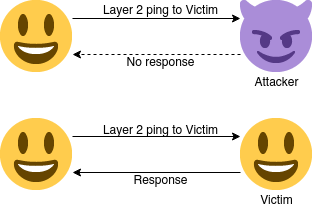
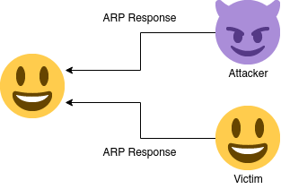
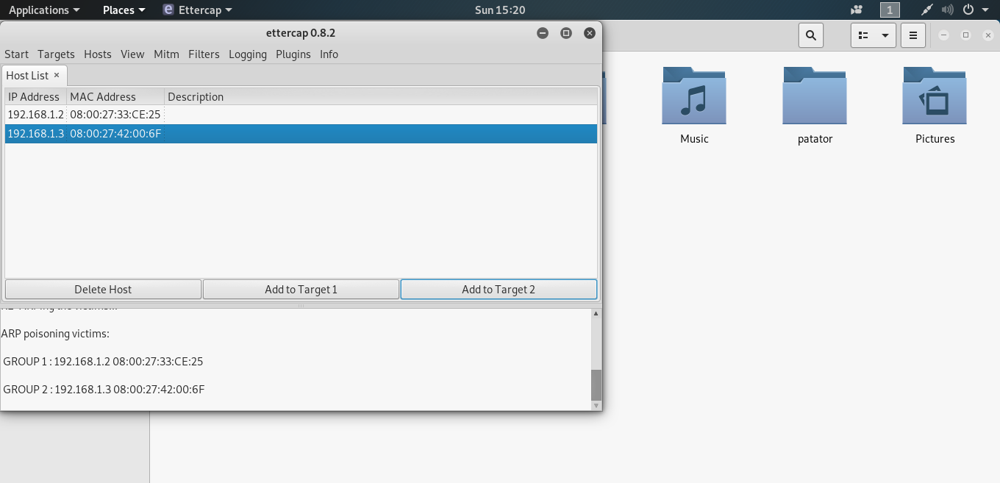
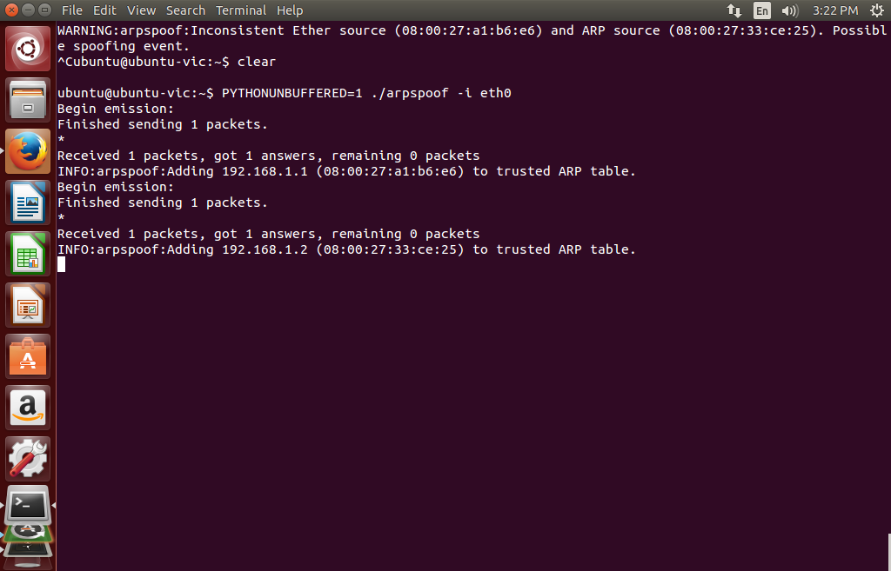

# ARP Spoof Detection
## CS4115 Final Project

Beiqi Li

---

# Background

- ARP is unauthenticated - Can be easily spoofed.
- S-ARP - which does have authentication - is not widely used.
- Write-once ARP table - Isn't quite standard compliant and can learn the spoofed packet.
- Static MAC entries - Hard to maintain for larger networks.

----

- Passive detection
  - Tracking ARP traffic and looking for inconsistencies.
  - Slow response. Performs bad on larger networks.
  - May also learn the wrong IP-MAC pair.
  - Does not detect ARP table overflow attack.

---

# Active detection

- Proposed by Ramachandran, et al. (2005).
- Use basic ping techniques and only check once - low overhead.
- Fast response.
- ARP responses are verified actively before learning.
- Possible to discover real IP-MAC pair under some conditions.

---

# Assumptions

- IP packets delivered to a machine that has the wrong destination IP will be dropped by the OS IP stack.
- We can use e.g. TCP pings sent on layer 2 to verify if a host is really using the IP.

---

# Assumptions

- Attacker will not stop victim from replying to ARP requests.
- We can send an ARP request to the potential victim and see if we got multiple replies.

---

# Detection flow

- Sniff ARP traffics.
- Raise warning directly when:
  - The packet has different Ether MAC address and ARP MAC address.
  - The IP/MAC pair does not match our records.
- Otherwise, start active probing.

---

# Active probing

- ARP session (flow): (`initiator mac`, `initiator ip`, `target ip`)
- 3 possible types:
  - Request half cycle - the flow passes a predefined time out and has 0 reply.
  - Response full cycle - unsolicited reply from target.
  - Full cycle - the flow passes a predefined time out and have 1+ replies.

----

- 2 main features:
  - \# of responses of an ARP request (from us or sniffed)
  - Whether or not a host responds to TCP ping.

---

# Handling different flow types

----

- Simplified:
  1. Initiator: Always verify via layer 2 TCP pings.
  2. If it's a complete ARP session, verify all responders with layer 2 TCP pings.
  3. If there are only ARP responses, initiate an ARP session ourselves and treat all responders as with 2.

----

- Request half cycle
  - Check the initiator with TCP ping and raise warning if there's no response.
  - Otherwise record the IP/MAC pair.
- Response half cycle
  - Send an ARP request to the target and raise warning if there are 0 or more than 1 responses.
  - Otherwise, check the target with TCP ping and raise warning if there's no response.
  - Otherwise record the IP/MAC pair.

----

- Full cycle
  - Check the initiator with TCP ping and raise warning if there's no response, and
  - Raise warning if there are 0 or more than 1 captured ARP responses.
  - Otherwise, check the target with TCP ping and raise warning if there's no response.
  - Otherwise record the IP/MAC pair.

----

- Real host detection - in case of 1 or more available ARP responses
  - Check every target with TCP ping.
  - If there are exactly 1 reply, the replier is likely the real host (victim).
  - Otherwise, the real host cannot be detected.

----

- If there is no response, the attacker may be injecting invalid ARP records (e.g. table overflow).
- If there are more than 1 responses, the attacker is manually handling/forwarding packets.

---

# Implementation

- Python 3.9 and Scapy.
- Implements all functionalities described in the paper.
- Simple MITM test with Ettercap shows promises.

---

# Demo

- Setup:
  - 2 victim VMs runs side-by-side.
  - Attacker Kali VM runs Ettercap and initiates ARP-spoofing-based MITM attack towards the 2 victim VMs.
  - The Ubuntu victim VM runs our software.

---

# Victim

 <!-- .element: width="80%" height="80%" -->

----

# Attacker

---

# Control

 <!-- .element: width="80%" height="80%" -->

---

# Future improvements

- Test more scenarios.
- Fix edge cases.

---

# References

- [Detecting ARP Spoofing: An Active Technique][ram2005] by Ramachandran, et al. (2005)
- [Ettercap and middle-attacks tutorial][ettercap] (info on how to set up Ettercap for MITM)
- [Scapy][scapy] (the packet manipulation framework used in this project)

[ram2005]: https://dx.doi.org/10.1007/11593980_18
[ettercap]: https://pentestmag.com/ettercap-tutorial-for-windows/
[scapy]: https://scapy.net/

---

# Thank you!

